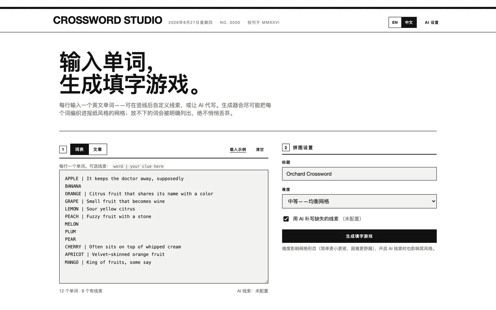
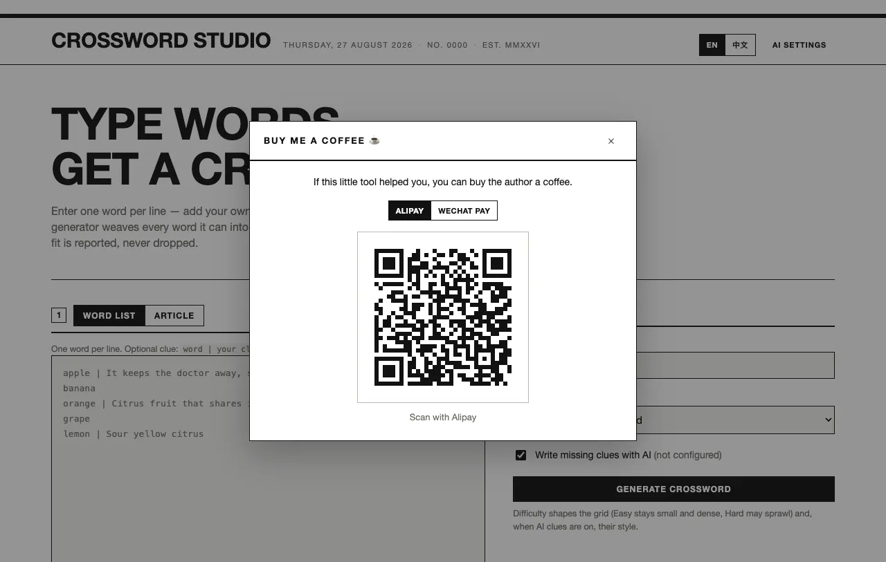

# Crossword Studio

[English](./README.md) | 简体中文


一个**零依赖的纯 Web 应用**：输入一组英文单词——或整篇英文文章——自动生成报纸风格的填字游戏（Crossword）。在线作答、编辑线索、打印 A4 试卷（可选答案页）、用一个链接分享整套拼图。

老师需要几分钟内出好一张课堂练习卷；学习者和拼图爱好者想直接开玩、随手分享。Crossword Studio 完全跑在浏览器里——无需服务器、无需账号、无需构建——粘贴词表、点击生成，分享就是一个 URL。

> AI 助手与智能体：如需结构化、机器友好的项目说明，
> 请阅读 [README_FOR_AI.md](./README_FOR_AI.md)。

## 在线体验

**[打开在线工具 →](https://petrel2015.github.io/crossword-studio/)**

## 文档

| 文档 | 内容 |
| --- | --- |
| [使用指南](./docs/zh/usage.md) | 分步操作：两种输入模式、作答、编辑、打印、分享 |
| [开发指南](./docs/zh/development.md) | 环境、命令、测试套件、目录结构 |
| [架构说明](./docs/zh/architecture.md) | 模块、数据流、放置引擎、URL 编解码 |
| [部署指南](./docs/zh/deployment.md) | GitHub Pages / Netlify / 任意静态托管 |
| [故障排查](./docs/zh/troubleshooting.md) | 常见症状与修复 |
| [隐私说明](./docs/zh/privacy.md) | 存了什么、发到哪里——逐条对照代码 |
| [常见问题](./docs/zh/faq.md) | 范围边界与常见疑问 |
| [功能设计文档](./docs/zh/features/index.md) | 大功能的设计决策记录 |
| [更新日志](./CHANGELOG.zh.md) | 版本历史（Keep a Changelog 格式） |

English docs: [English index](./docs/en/index.md) · [Changelog](./CHANGELOG.md)

## 输入模式

| 模式 | 你提供什么 | 线索来源 |
| --- | --- | --- |
| **词表** | 每行一个单词，竖线后可加线索 | 你自己的线索；AI 词典式线索；或留空（后续可编辑） |
| **文章** | 粘贴一篇英文文章 | **AI 文章式线索**（引用文中情节、模仿文章语气）或**离线原文填空**（`选自原文："…the keeper trimmed the ______ each dusk"`） |

文章模式下，候选词**完全在本地提取**（过滤功能词、复数归并、专有名词识别、按词频与位置评分排序），由你勾选想要的词，也可以手动补充自定义词。



## 功能特性

### 报纸风生成

单词在严格的交叉规则下编织（交叉字母一致、禁止并行重叠、禁止意外相邻串词），按标准方式编 Across/Down 序号，多轮随机尝试中挑出最紧凑的布局。放不进棋盘的词会连同**原因**一起列出——绝不悄悄丢弃。


→ 设计决策：[生成引擎](./docs/zh/features/generation-engine.md) · 操作方法：[使用指南](./docs/zh/usage.md)

### 文章提取与原文填空

粘贴文章，得到带出现次数的候选词排行，一键选 Top 10，也可手动补充。挖空线索把单词从它所在的句子里挖掉——完全离线，整词匹配安全（`CARE` 绝不会误伤 `CAREFUL`）。


→ 设计决策：[文章提取与挖空](./docs/zh/features/article-extraction-cloze.md)

### AI 线索撰写

默认通过**内置 AI 服务**（PromptGate 网关）开箱即用——无需密钥、无需配置；也可在 **AI 设置**里换成自己的 OpenAI 兼容接口。撰写词典式线索（词表模式）或文章式线索（文章模式），风格随难度调整。AI 不可用？一切照常——线索留空可编辑，文章模式自动回落到离线挖空。

→ 设计决策：[AI 线索](./docs/zh/features/ai-clues.md) · 配置表：[使用指南 → AI 线索](./docs/zh/usage.md#ai-线索)

### 作答界面

点击输入（桌面键盘与手机输入法均支持）、方向键导航、方向翻转、点击线索定位并高亮当前词、检查（红笔标记）、提示、揭示字母 / 单词 / 整盘、计时器。进度按拼图自动保存——字母、揭示记录与用时在刷新后依然都在。

### 打印 / PDF

A4 纵向、纯黑白；打印专用标题可编辑；日期可显示 / 隐藏 / 自定义；可选答案页；屏幕预览即真实版面；「导出 PDF」= 浏览器的*存储为 PDF*。


### 链接分享

整套拼图压缩进 URL 哈希（`#p=…`，gzip + base64url）——任何人打开链接即作答同一套题，无需服务器。损坏或被改动的链接会明确报错，而不是渲染出坏盘。

→ 设计决策：[分享链接](./docs/zh/features/share-links.md)

### 请我喝杯咖啡

网站页脚有 ☕ 入口，点开是支付宝 / 微信支付切换的赞赏弹窗。二维码**由你的浏览器实时生成**——没有静态图片，没有第三方二维码 API。



→ 设计决策：[赞赏弹窗](./docs/zh/features/donation.md)

同样内置：**英文 / 简体中文**切换（右上角，默认跟随浏览器语言）与**多端适配**（桌面双栏、平板线索双栏下排、手机单栏 + 工具栏横滑）。

## 快速开始

无需构建，两种运行方式：

```bash
# 方式一 —— 直接双击 index.html 用浏览器打开

# 方式二 —— 起本地服务（推荐；对 CORS 严格的 AI 服务商需要 http 环境）：
python3 -m http.server 8741
# 打开 http://localhost:8741/
```

部署 = 把文件夹拷到任意静态托管（GitHub Pages、Netlify、对象存储、内网文件共享……）。没有后端。详见[部署指南](./docs/zh/deployment.md)。

## 基本用法

1. 粘贴词表（每行一个单词，竖线后可加线索）——或切到**文章**模式粘贴英文文章，点击「提取候选词」。
2. 填标题、选难度，点击**生成填字游戏**。
3. 在浏览器里作答（或打印出来），随时通过**编辑**修改线索，用**分享**里的链接把题发给任何人。

完整图文教程：[docs/zh/usage.md](./docs/zh/usage.md)。

## 配置 AI 线索

AI 线索默认使用内置 AI 服务，无需任何配置。想用自己的模型？点击右上角 **AI 设置**，切换到任意 OpenAI 兼容的 `/chat/completions` 接口：

| 服务商 | Base URL |
| --- | --- |
| OpenAI | `https://api.openai.com/v1` |
| 火山方舟 | `https://ark.cn-beijing.volces.com/api/v3` |
| DeepSeek | `https://api.deepseek.com/v1` |
| Ollama（本地） | `http://localhost:11434/v1` |

- 弹窗里的「**测试连接**」可立即验证当前选择的服务是否可达。
- 自定义接口的 API 密钥只保存在你浏览器的 localStorage，只发给你配置的接口。
- 只有无线索的词（词表模式）或文章节选 + 选定词（文章模式）会被发送，其他数据不离开浏览器。
- 失败（不可达 / 限流 / 每日额度用完）以友好文案提示，**绝不自动重试**。若自定义服务商禁止浏览器直连（CORS），请换用支持 CORS 的接口或保持手动写线索。

网络行为逐条审计：[docs/zh/privacy.md](./docs/zh/privacy.md)。

## 技术栈

- 纯 HTML / CSS / JavaScript（ES2017+，经典脚本——`file://` 直接打开也能用）
- 零运行时依赖；jsdom（仅开发）用于端到端测试
- 现代 Web 平台能力：`CompressionStream`、`ResizeObserver`、`navigator.share`、`localStorage`

## 架构概要

```
词表 ─────┐
          ├─► Extract（本地，文章模式）─► 候选词 ─► AI / 挖空 ─► 线索
文章 ─────┘                                                  │
                                                             ▼
        Generator（N 轮随机尝试 · 放置规则 · 编号）──────► layout
                                                             │
        ├─► 作答界面（输入 / 检查 / 揭示 / 计时 ⇄ localStorage 进度）
        ├─► 打印构建器（A4 预览 = 真实打印 DOM · 标题/日期覆盖）
        └─► URL 编解码（gzip + base64url ⇄ #p=… 分享链接）
```

核心是稀疏 Map 的放置引擎：每次放置都按经典交叉规则校验，按 `交叉数×权重 − 包围盒增长 − 长宽拉伸 + 抖动` 评分，并在多轮间重试，最终选最优尝试。同一种子必得同一布局，每次生成都换新种子。逐模块说明：[docs/zh/architecture.md](./docs/zh/architecture.md)。

## 兼容性

- 现代常青浏览器（Chrome、Edge、Firefox、Safari——桌面与移动）均可使用；从 `file://` 直接打开也能跑。
- 分享链接优先使用 `CompressionStream`（gzip），不可用时回落为普通 base64url；旧浏览器只是拿到更长的链接。
- 没有 Service Worker / PWA / 离线安装机制——页面仍需照常从某个主机（或本地文件）加载。

## 更新日志

见 [CHANGELOG.zh.md](./CHANGELOG.zh.md)（English: [CHANGELOG.md](./CHANGELOG.md)）。仓库目前没有 Git Tag 与 GitHub Release；v1.2.0 为汇总条目，描述当前完整功能集。

## 参与贡献

欢迎提交 Issue 与 Pull Request。目前没有正式的贡献者协议（CLA）；提交 PR 即视为同意你的贡献随项目一起发布。提交前请先跑测试：

```bash
npm install && npm test
```

## 许可证说明

**本仓库目前没有 LICENSE 文件。**在补上许可证之前，默认保留所有权利。如果你想复刻或复用代码，请先开 Issue 询问。维护者可参考 [docs/zh/development.md → 添加许可证](./docs/zh/development.md#添加许可证) 中的建议清单。

---

## 请我喝杯咖啡 · Buy me a coffee

如果这个小工具帮你省下一个做拼图的下午，欢迎请作者喝杯咖啡——用网站页脚的 **☕ 请作者喝杯咖啡** 入口：弹窗里可切换支付宝 / 微信支付，二维码**由浏览器实时生成**（无任何静态图片）。下方两图为仅用于本 README 的静态呈现：

<p align="center">
  
  
</p>

<p align="center"><em>支付宝 · 微信</em></p>
