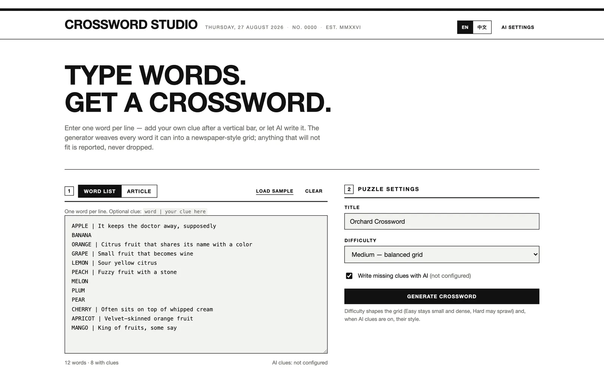
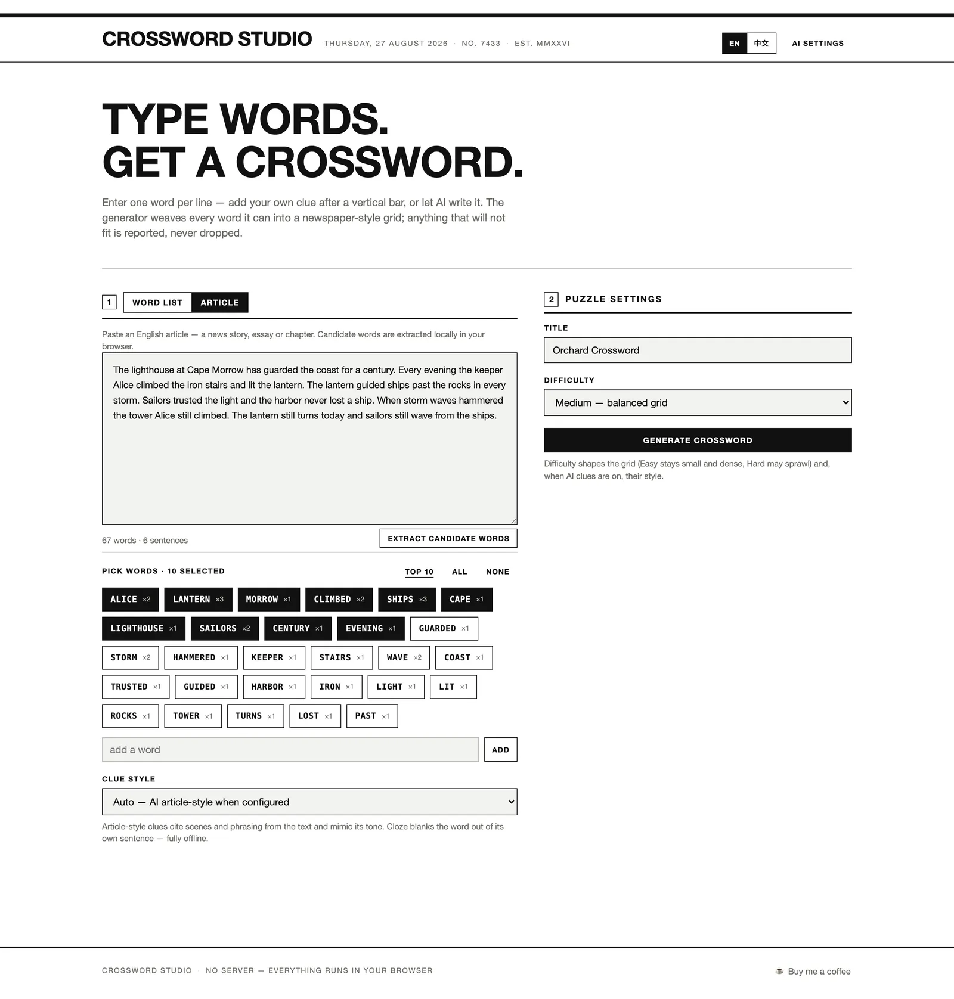
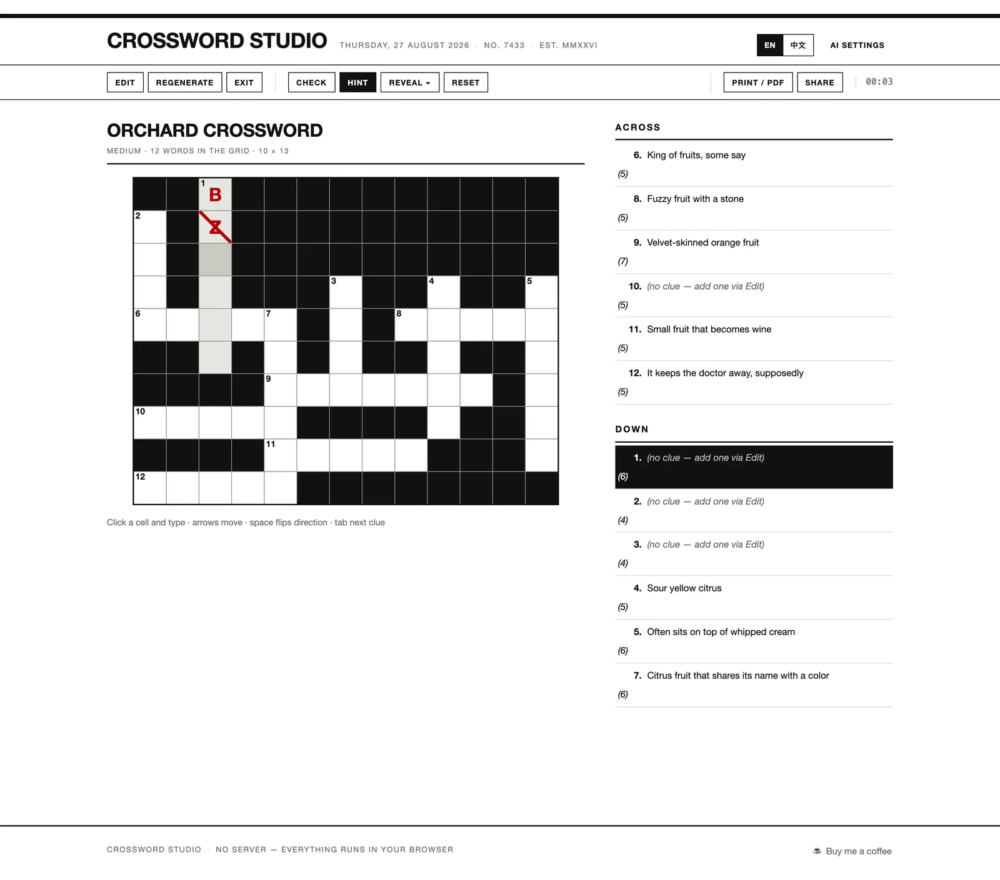
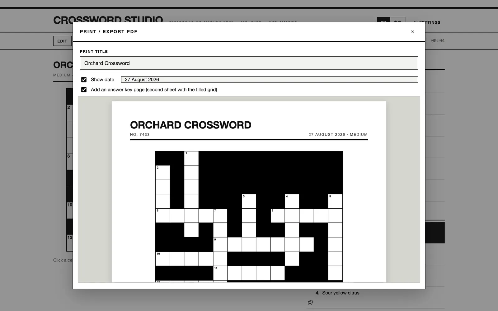

# Usage Guide

Everything Crossword Studio can do, step by step. For what the project
is, see the [README](../../README.md); for design decisions behind each
feature, see [features/index.md](./features/index.md).

## Run the app

- **Open directly**: double-click `index.html`. Everything except some
  AI providers works from `file://`.
- **Serve locally** (recommended):

  ```bash
  python3 -m http.server 8741
  # open http://localhost:8741/
  ```

Or use the hosted demo: <https://petrel2015.github.io/crossword-studio/>.

The interface is English or 简体中文 — switch at the top right; the
default follows your browser language. Your choice is remembered.

## Build a puzzle from a word list



1. Stay on the **Word list** tab (mode 1).
2. Enter one word per line. Optionally add your own clue after a
   vertical bar: `apple | It keeps the doctor away, supposedly`.
3. The counter below the box shows how many words were parsed and how
   many have clues. Parse problems appear underneath (see the error
   table below).
4. Optionally tick **Write missing clues with AI** (visible only in word
   list mode; uses the built-in AI service by default — no setup needed —
   or your own endpoint via [AI Settings](#ai-clues)).
5. In **Puzzle settings** (mode 2): set a title (max 72 characters) and a
   difficulty:
   - **Easy** — dense, compact grid
   - **Medium** — balanced grid
   - **Hard** — sprawling, sparse grid
6. Click **Generate crossword**.

Tip: **Load sample** fills in a 12-word fruit puzzle; **Clear** empties
the box. Your word list is auto-saved as a draft, so an accidental
refresh loses nothing.

## Build a puzzle from an article



1. Switch to the **Article** tab.
2. Paste an English article (a news story, essay or chapter). A live
   counter shows words and sentences; very short texts are rejected.
3. Click **Extract candidate words**. The analysis runs entirely in your
   browser: function words are removed, plurals are merged
   (`ships`/`ship` count together), proper nouns are recognised, and the
   rest are ranked by frequency and prominence. Each chip shows its
   occurrence count (×3 etc.).
4. Select words with the checkboxes, or use **Top 10 / All / None**. Add
   custom words (max 12 letters) with the **add a word** box.
5. Pick a **Clue style**:
   - **Auto** — AI article-style, falling back to offline cloze if the AI pass fails entirely
   - **Cloze from the text (offline)** — the word is blanked out of its
     own sentence: `From the text: "…the keeper trimmed the ______ each
     dusk"`
   - **AI article-style** — clues that cite scenes and phrasing from
     your text and mimic its tone
6. Set title/difficulty and click **Generate crossword**.

Generating without any selected word is blocked; select at least one.

## Solve the puzzle



- **Type**: click a cell and type. On phones the on-screen keyboard works
  too (an invisible input captures typing).
- **Move**: arrow keys move; **Space** flips Across/Down; **Tab** jumps to
  the next clue.
- **Locate**: click a clue to jump to its word; the current word and cell
  stay highlighted.
- **Check** marks wrong letters with a red pencil stroke.
- **Hint** reveals one correct letter in the current word.
- **Reveal ▾** reveals the current letter, the current word, or the whole
  puzzle (with a confirmation).
- **Reset** clears your entries for this puzzle (with a confirmation).
- The **timer** runs while you solve; a banner appears when the puzzle is
  complete.

Progress auto-saves per puzzle: letters, reveals and elapsed time survive
a refresh. Progress is keyed by layout+answers, so editing clues or the
title does not reset it, while regenerating does.

## Edit a puzzle

Click **Edit** in the toolbar to open the drawer:

- Change the **title**.
- Change the **difficulty** (takes effect when you regenerate).
- Rewrite **any clue**.
- **Save changes** applies everything in place; **Save & regenerate**
  also re-lays out the grid (your clue edits are kept and re-applied to
  the new layout where the words still fit).

## Print / PDF



1. Click **Print / PDF**. The modal shows the actual A4 pages that will
   print.
2. Optionally override the **print title** (does not change the puzzle's
   title), toggle **Show date** (or type a custom date), and tick **Add
   an answer key page** (a second sheet with the filled grid).
3. Press **Print** and choose a printer — or choose **Save as PDF** in
   the browser's dialog to export a PDF. The output is pure black on
   white.

## Share a puzzle

Click **Share**:

- On phones with a native share sheet, the puzzle link opens the system
  share dialog.
- Otherwise a modal shows the puzzle URL (`…/#p=…`) for copying.

The link contains the entire puzzle. Anyone who opens it gets the same
puzzle, ready to solve — no server, no account. For how the format works
and how tampered links are rejected, see
[Share links](./features/share-links.md).

## AI Clues {#ai-clues}

Clue writing uses the **built-in AI service** (a PromptGate gateway) by
default — it works out of the box, no key to configure. In **AI Settings**
you can instead switch to a **custom OpenAI-compatible endpoint**:

| Provider | Base URL |
| --- | --- |
| OpenAI | `https://api.openai.com/v1` |
| Volcengine Ark | `https://ark.cn-beijing.volces.com/api/v3` |
| DeepSeek | `https://api.deepseek.com/v1` |
| Ollama (local) | `http://localhost:11434/v1` |

Setup: click **AI Settings** (top right) → choose "Custom OpenAI-compatible
endpoint" → enter Base URL, API key and model name → Save. The key is stored
only in your browser's localStorage and sent only to that endpoint. The
dialog's **Test connection** button checks immediately whether the selected
service is reachable.

Behavior:

- Word-list mode fills only entries whose clue is empty.
- Article mode sends the article excerpt plus the selected words, in
  batches with a progress indicator; a failed batch never cancels the
  others. The built-in service batches automatically to fit its
  input/output limits (6 words per request, ≤ 2,000 characters of message
  content in total); custom endpoints use 20 words per batch.
- Clue style follows difficulty (easy = plain and friendly, hard =
  misdirection and puns).
- Failures are reported with a friendly message and are **never
  auto-retried** (the gateway charges quota on every attempt): service
  unreachable or auth rejected → "The AI settings are unavailable — please
  check the configuration"; rate-limited → wait about a minute; daily
  quota exhausted → try again tomorrow; upstream trouble → retry later.
- With the **Auto** clue style, a total AI failure falls back to offline
  cloze clues; in word-list mode a failed AI pass just leaves the clues
  blank and editable — everything else keeps working.

Network details: [Privacy](./privacy.md). Design decisions:
[AI clue writing](./features/ai-clues.md).

## Error handling

| Situation | Behavior |
| --- | --- |
| Word shorter than 3 letters or longer than 12 | Listed under the input: "minimum 3" / length issue; the word is ignored |
| Non A–Z characters (accents, hyphens) | Stripped before validation; the remaining letters are used |
| Duplicate word | Listed as a duplicate; only the first occurrence is kept |
| Word with internal spaces | Listed as a spaces issue |
| Article too short | "Extract candidate words" does nothing visible — paste a longer text |
| Generate with no words / no selected candidates | Stays in the builder; nothing is generated |
| AI article-style with an incomplete custom endpoint | Toast explains AI is not configured; stays in the builder (the built-in service always counts as configured) |
| AI service unreachable / rate-limited / daily quota exhausted | Toast with the matching message (see AI Clues above); everything else keeps working |
| Word cannot be placed | Listed under the grid with a reason: shares no letters / every crossing conflicts / exceeds the difficulty's grid limit |
| Share link corrupted or hand-edited | The app refuses to render and reports invalid puzzle data |

## Boundary behavior

- Regenerating keeps your edited clues but produces a new layout (new
  seed) and resets progress.
- The print-only title override never changes the saved puzzle title.
- Language switching rebuilds all dynamic views but preserves progress
  and the running timer.
- Solving progress belongs to one browser profile; there is no sync and
  no server copy.
